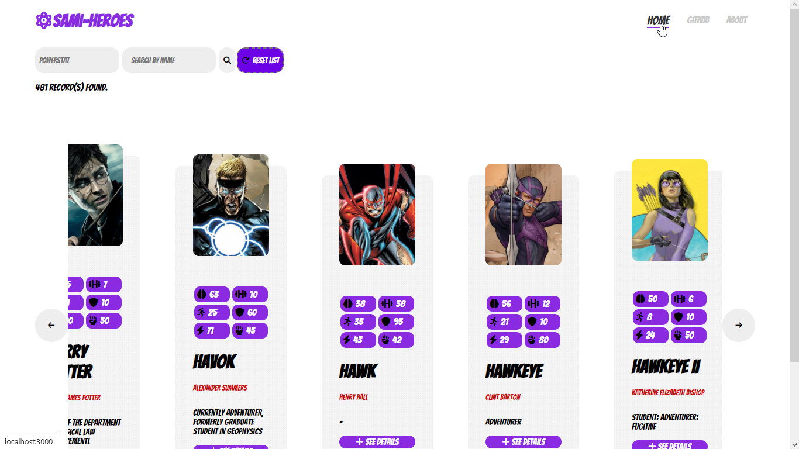
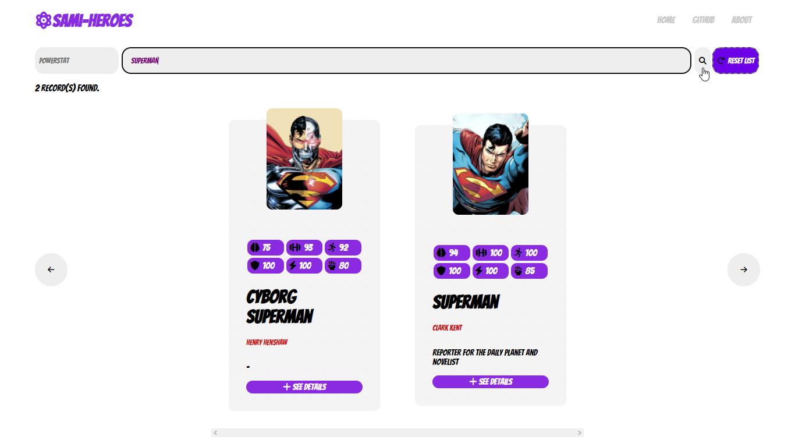
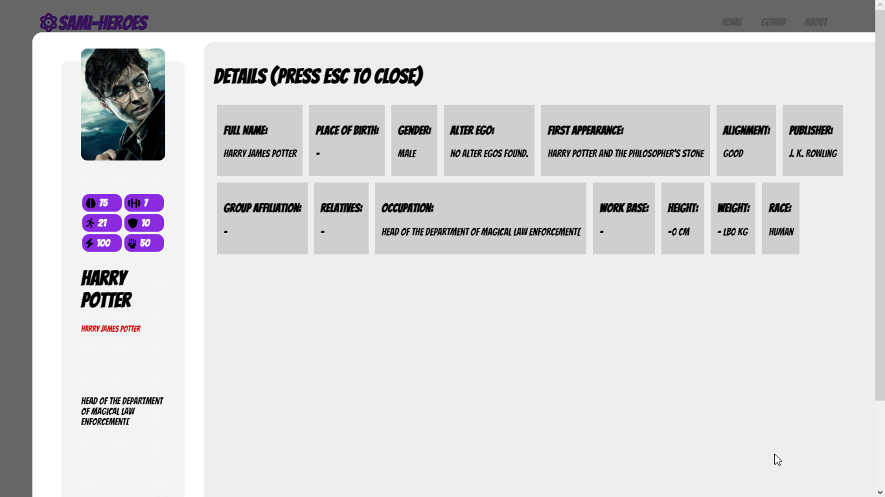

<div align='center'>
</a>
  
<a href='https://github.com/luisdourado33/sami-heroes/blob/main/LICENSE'>
  

</a>
  
</div>
## 🧐 Sobre o projeto

> Este projeto faz parte do processo seletivo da empresa Sami Saúde.
> 
> Todos os dados aqui utilizados foram obtidos através da API gratuita SuperHero API.

**Leia mais sobre a API em: [introdução](https://www.superheroapi.com).**

# 👨‍💻 Stack(s) utilizada(s)

Essa lista possui uma visão geral à respeito das tecnologias utilizadas para a implementação:

- Este projeto utiliza [ReactJS](https://pt-br.reactjs.org). ReactJS é uma biblioteca JavaScript para criar interfaces de usuário.
- Para o gerencimento de estados, foi utilizado a biblioteca [Redux](https://redux.js.org) 
- Identação e formatação de código foram dadas por conta do [StandardJS](https://standardjs.com) e Prettier + ESLint.
- A arquitetura e metodologia utilizada para a criação da aplicação é a [Atomic Design](https://atomicdesign.bradfrost.com/chapter-2/). 

# 📝 Instalação

Antes de executar a aplicação, é necessário que o [Node](https://nodejs.org/en/) esteja instalado na máquina.

Primeiro, clone o projeto:

```
git clone https://github.com/luisdourado33/sami-heroes.git
```

Agora, acesse a pasta do projeto e execute a instalação das bibliotecas necessárias:

```
npm install
// ou (recomendado)
yarn start
```

Depois de ter finalizada a instalação da bibliotecas, basta iniciar o projeto com o seguinte comando:

```
npm start
// ou
yarn start
```

É recomendado que seja utilizado o *yarn* para a execução dos scripts.

# ✍️ Screenshots

 - Página inicial


- Pesquisa de herói


- Modal de detalhes


# ⚠️ Licença (License)

Sami-Heroes is free and open-source software licensed under the GNU General Public License v3.0. All designs were created by [Luís Dourado](https://github.com/luisdourado33).

<br />

---

<br />

# 💛

Lembre-se que *você é gigante, você é suficiente e sua presença é valiosa.* 